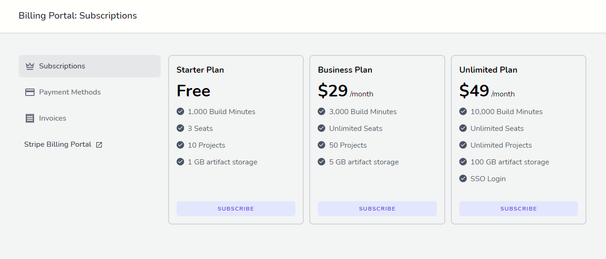

# ⚡ Introduction

      

Cashierstream is a simple Spark alternative written for Laravel Jetstream, with the super-power of tracking plan quotas, like seats or projects number on a per-plan basis. It comes with built-in stacks and design files for easy scaffolding, so you can start defining your billing options instead of building a portal. 🚀

 **Currently, only Inertia with Stripe is supported. For Livewire, any PR is welcomed!**

****
